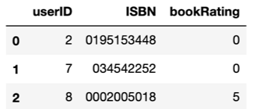
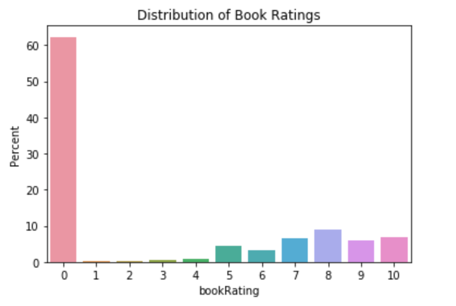
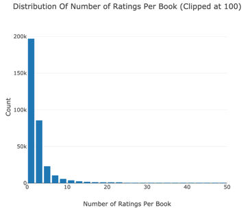
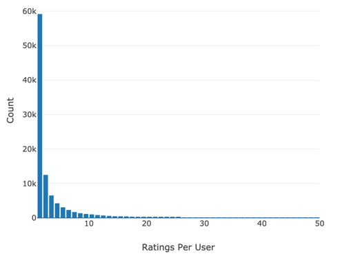
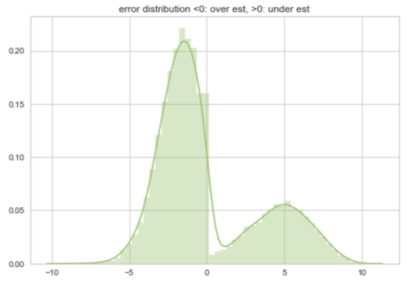

# recommender_collaborative_filtering_book_crossing

Email: chgao@ucdavis.edu
By: William Gao

*Kernel* Access: https://colab.research.google.com/drive/1gPPYHpmvuOyxrgMOaCKtJCAaSkwgm9Pb 
## Overview
There are two most popular approaches to build recommender system. They are collaborative filtering and content-based recommendations. This notebook focuses on building a recommender system with surprise library – a highly reputed library. The dataset employed for training the collaborative model is Book-Crossing data. The dataset contains book ratings and user ids associated with those ratings. The goal is to train a surprise recommendation model with 75% of the Book-Crossing Data and predict the remaining 25%. 

## Techniques and Procedure
### Steps
1.	Ingest data: The book ratings and user ids associated with those ratings are in different files. Therefore, a Pandas merge function was called to join the two tables. 

2.	Exploratory data analysis was performed to uncover the distribution of ratings for books and ratings for users. What I discover here is that over 60% of book has 0 ratings. Readers are reluctant to rate books when they are bad so we can assume 0 rating books are generally really bad. Most books receive 5 ratings and the most rated books received 2502 ratings. 

3.	I also evaluated the possibility to use this dataset for fitting the recommendation model by taking a look at the number of users who rated the books. And the number of participating users are substantial to build a recommendation model. 

4.	Then, in order to mitigate the memory shortage caused by the massive data, the records with book rating count < 50 and user rating count < 50 were filtered based on above findings and assumptions. Number of rows were shrink down from 1,149,780 to 140,516.
5.	According to similar performance grid search, I decided to build the recommendation system with BaselineOnly algorithm for the modeling building and EMSE came at 3.37 which is acceptable. 
6.	Finally, a histogram of error between predicted rating and actual rating were plotted to visualize the performance. And interesting pattern is discovered here. 

## Conclusion
	The surprise model is reasonably accurate library to make recommendation for this type of rating recommendation, the model used here is baseline model and it is interesting to the error distribution for overestimated ratings versus under estimated ratings, both of the errors are normally distributed on both side of 0. The model can be improved by applying punishment values (need more research and testing) bring the mean of error close to 0 from both under estimation and under estimation. 
	Another conclusion is that this recommendation model is helpful to make prediction on new released books and make recommendation to users. It will be interesting to go a bit further with this dataset to make recommendation that tailor to each user.  
